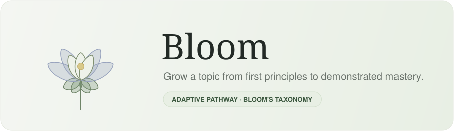

<p align="center">
  
</p>

<p align="center">
  
  
  
  
</p>

<p align="center"><i>Type any topic. Bloom grows it from first principles to demonstrated mastery — one blooming flower at a time.</i></p>

---

## 🌱 What is Bloom?

**Bloom** turns any subject into an adaptive learning pathway built on **Bloom's taxonomy**. You name a topic; an AI curriculum engine breaks it into subtopics and skills, an AI study engine writes each lesson on demand, and an adaptive assessment loop keeps testing you until it's genuinely confident you've mastered every skill. A mastery **flower** blooms petal by petal as you clear each tier.

There are no accounts and no database — you load in, do your work, and finish. The whole session lives in your browser.

## 🌸 The three tiers

Each subtopic is mastered one tier at a time, mirroring the levels of Bloom's taxonomy:

| Tier | Bloom level | How it's assessed |
|------|-------------|-------------------|
| **Tier 1** | Knowledge & Comprehension | MCQ + short-answer, graded by a Bayesian mastery model |
| **Tier 2** | Application & Analysis | Short + long-answer, graded against the lesson |
| **Tier 3** | Synthesis & Evaluation | A live **Socratic defense** — argue your stance against an AI examiner until it's convinced |

## ✨ How it works

1. **Curriculum** — a topic is expanded into subtopics, each with a set of assessable skills.
2. **Study** — each subtopic's lesson is generated *lazily*, the first time you open it, and cached for the session.
3. **Assessment (BKT)** — questions are generated per skill, weighted toward your weakest ones. Every answer updates that skill's **P(L)** (probability you know it) via **Bayesian Knowledge Tracing**; the subtopic is mastered once *every* skill passes 95% confidence. Harder, lower-guess question types are forced as you near mastery, so you can't luck your way through.
4. **Defense** — Tier 3 is a rigorous back-and-forth where you must evaluate and synthesize, not just recall.
5. **Bloom** — clear a whole tier across every subtopic and the flower opens another stage.

## 🧩 Architecture

Bloom is **fully stateless**. Every request carries all the context it needs, every response returns everything the client must remember, and the server persists nothing between calls.

- **Frontend** (`web/`) — a multi-page static site served by the API itself. The browser's `sessionStorage` *is* the database: it holds the curriculum, the study guides generated so far, per-skill BKT progress, and defense transcripts. "New prompt" wipes it and starts fresh.
- **Backend** (`main.py`) — one FastAPI app that serves the frontend and exposes:
  - `POST /api/build-pathway` — topic → curriculum
  - `POST /api/study` — one subtopic → its study guide (lazy)
  - `POST /api/question` / `POST /api/grade` — the Tier 1/2 BKT loop
  - `POST /call_model` — the Tier 3 defense chatbot
- **Engines** (`backend/`) — a curriculum generator, a study-guide generator, a question generator, a BKT assessor, and the defense examiner + judge.
- **Model registry** (`backend/shared/models.py`) — **every** LLM is constructed here, lazily, and chosen by an environment variable. Swapping any model (local Ollama ↔ Groq ↔ Gemini ↔ OpenAI ↔ Anthropic) is a one-line config change, never a code change.

## 🚀 Quick start

Bloom is a [uv](https://docs.astral.sh/uv/) project. 

You can try it out on [render](https://bloom-phk8.onrender.com/), or set it up yourself with the instructions below:

```bash
# 1. install dependencies
uv sync

# 2. configure models + keys
cp .env.example .env      # then fill it in (see below)

# 3. run — serves the API and the frontend together
uv run uvicorn main:app --reload

# open http://127.0.0.1:8000
```

Want to click through the whole UI **without spending a token or needing any keys**? Run in mock mode — it serves the checked-in sample fixtures:

```bash
USE_MOCK=true uv run uvicorn main:app --reload
```

## 🔧 Model configuration

Each role reads its model string from an environment variable, so you can mix providers freely. Defaults ship pointing at local Ollama for the exam/defense and Gemini for content.

| Role | Env var | Example |
|------|---------|---------|
| Tier 3 examiner | `EXAMINER_MODEL` | `groq:llama-3.3-70b-versatile` |
| Defense judge | `JUDGE_MODEL` | `groq:llama-3.3-70b-versatile` |
| Question generator | `QUESTION_MODEL` | `groq:llama-3.3-70b-versatile` |
| Answer grader | `GRADER_MODEL` | `groq:llama-3.3-70b-versatile` |
| Curriculum | `CURRICULUM_MODEL` | `google_genai:gemini-2.5-flash` |
| Study guides | `STUDY_MODEL` | `google_genai:gemini-2.5-flash` |

Add the matching API key(s) — `GROQ_API_KEY`, `GEMINI_API_KEY`, `OPENAI_API_KEY`, `ANTHROPIC_API_KEY` — to your `.env`. Only the providers you actually use need one; local Ollama needs none.

## ☁️ Deploy

Because the app is stateless and serves its own frontend, one web service is the whole thing. On a host like **Render**, **Cloud Run**, or **Hugging Face Spaces**:

- Start command: `uvicorn main:app --host 0.0.0.0 --port $PORT`
- Add your model + key environment variables in the host's secrets panel
- Point the exam/defense models at a cloud provider (no GPU host can run a local 30B model)

---

<p align="center"><sub>Built on Bloom's taxonomy · assessment powered by Bayesian Knowledge Tracing · 🌸</sub></p>
